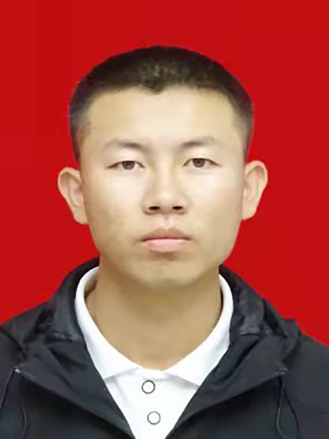

    

        

            <h1 style="margin-right: 0px;float:left;"> 王辉 </h1>
                 
            

                
                    
                    13289596985
                
                ·
                
                    
                    2545938497@qq.com
                
                ·
                
                    
                    <a href="https://5f03951e21.zicp.fun/" target="_blank">我的web</a>
                
                ·
                
                    
                    <a href="https://blog.csdn.net/weixin_53742691" target="_blank">我的博客</a>
                
                  
            

        

        

            
        

    

>  **座右铭：给我一个平台，创就一个高度！**

##  个人信息

- 男，2000 年出生
- 求职意向：Java 开发工程师 / 运维工程师
- 工作经验：1 年
- 期望薪资：8K+

##  教育经历

- 天津职业大学，计算机应用技术
##  校内荣誉

- 2020-2021 校级优秀学生奖学金
- 2021-2022 校级二等奖学金
- 2021-2022 全国大学生数学建模二等奖
- 2021-2022 1+X大数据运维证书

##  技能清单

  

   Java技术栈 80%
  

Java Web，SpringBoot，SpringCloud...

  

   前端技术栈 70%
  

Html，CSS，BootStrap，Vue...

  

    大数据技术栈 70%
  

Hadoop，Zookeeper，Spark，Hive，

  

    组件类应用60%
  

Kafka，RabbitMQ，Redis，各类数据库...

  

    运维技术60%
  

服务器运维，网络运维...

##  工作经历

**宁夏尊园有限公司，酒店服务员**

   ***2020年7月至2020年9月***

- **高效执行服务流程：** 负责执行酒店高标准的服务流程，确保客人的需求得到迅速而周到的满足，提高客户满意度。

- **专业沟通技巧：** 通过优秀的口头和书面沟通技巧，与客人建立积极而专业的关系，使得客户在整个服务过程中感受到极致的关照。

- **团队协作与领导：** 在团队中积极协作，与同事协同工作，确保服务流畅进行。在需要的时候，能够担当领导责任，指导其他团队成员。

- **维护服务环境：** 负责维护酒店服务区域的整洁和有序，确保环境符合高端酒店的品牌形象。

- **问题解决能力：** 高效处理客人的投诉和问题，迅速找到解决方案，保持酒店形象的完整性。

**天津共同保安公司，中控安保负责人**

​	***2021年5月至2021年6月***

- **安保策略规划：** 负责制定和执行中控安保策略，通过全面的安全评估，设计并实施安保措施，确保公司安保工作的高效运转。

- **监控系统管理：** 管理和维护中控室内的监控系统，实时监测公司内外的安全状况，迅速应对潜在威胁，提高安全防范水平。

- **团队领导与培训：** 领导和管理中控安保团队，制定并实施培训计划，提高团队成员的专业水平和工作效率，确保团队始终保持高度警惕。

- **安保危机应对：** 负责协调和处理突发事件，包括但不限于安全漏洞、紧急救援、火警等，确保公司内外人员的生命和财产安全。

- **技术升级和改进：** 持续关注安保行业的新技术和趋势，提出和实施中控室设备的升级和改进计划，确保公司始终处于安全技术的前沿。

- **报告与沟通：** 定期向公司管理层报告安保工作进展和风险评估结果，与相关部门保持密切沟通，确保整个公司对安保工作的理解和支持。

**天津信诺金智科技有限公司，后端开发工程师兼运维**

​	***2022年5月至2022年9月，2023年4月——***

- **系统开发与维护：** 设计、开发和维护公司核心系统后端，确保系统高效稳定运行。通过不断的优化和升级，提高系统性能和用户体验。

- **数据库管理：** 负责设计和优化数据库结构，确保数据的安全性和可用性。实施备份和恢复策略，有效管理大量数据流。

- **API设计与实现：** 设计和实现高效的API，提供给前端团队使用，并确保API的稳定性和安全性。与前端团队密切协作，确保数据传输和处理的顺畅。

- **问题排查与解决：** 负责监控系统性能，及时发现并解决潜在问题。通过日志分析和性能测试，预防和降低系统故障风险。

- **持续集成与部署：** 设计和维护持续集成和部署流程，确保代码的快速、安全地部署到生产环境。采用自动化工具，提高部署效率。

- **运维工作：** 负责公司服务器和网络的日常维护和监控。确保服务器安全性，及时处理服务器故障和网络问题，保障业务的持续运行。

- **团队协作：** 与前端开发团队、产品团队密切合作，协同推进项目进度。分享最佳实践，提高整个团队的开发效率和水平。
##  项目经历

**一码通溯源管理系统**

**项目概述：**

> 一码通溯源管理系统是为了提高产品追溯性管理和信息透明度而开发的全面解决方案。该系统基于先进的信息技术，通过为每个产品生成独特的标识码，实现对产品生命周期的全程追溯，包括生产、流通、消费等各个环节。系统的主要目标是提高企业的管理效率，确保产品质量和安全，同时满足监管要求和消费者的需求。

**我的角色：**

> 我作为项目团队的核心成员，负责系统的后端开发、数据库设计和部分运维工作。在整个项目周期内，我与团队密切合作，确保系统的稳定性、安全性和高效性。

**关键特性和功能：**

1. **标识码生成与管理：** 实现每个产品的唯一标识码生成，并建立标识码的统一管理系统。

2. **追溯性查询系统：** 提供用户友好的查询界面，使得企业可以迅速溯源产品的生产批次、原材料来源等信息。

3. **生命周期监控：** 实时监控产品在生产、仓储、运输和销售等环节的状态，为企业管理决策提供实时数据支持。

4. **报表与统计分析：** 生成详尽的报表和统计数据，帮助企业深入分析产品的整个生命周期，发现潜在问题并提出改进建议。

5. **权限控制与安全性：** 实施严格的权限管理，确保只有授权人员能够访问和修改关键信息，保障信息的机密性和完整性。

**技术栈：**

- **后端开发：** 使用Java（SpringBoot框架）进行后端开发，保证系统的稳定性和高性能。

- **数据库设计：** 设计和优化Mysql数据库结构，确保数据的安全性和高效检索。

- **前端开发：** 采用现代化的前端框架，提供直观友好的用户界面。

- **系统部署与运维：** 负责系统的部署和运维工作，确保系统在生产环境中的稳定运行。

**成果与效益：**

> 一码通溯源管理系统的成功实施使得企业在产品管理和质量控制方面取得了显著的成果。公司生产流程更加透明，问题可以更迅速地被发现和解决。产品追溯性的提升也增强了消费者对产品质量和安全的信任感，同时也提高了公司在行业内的声誉。
>
> 这个项目经历不仅锻炼了我的技术实力，还培养了我在团队协作、项目管理和客户沟通方面的能力。

**企业办公业务系统**

**项目概述：**

> 企业办公业务系统是为提高企业内部管理效率而设计的综合性解决方案。该系统旨在整合和优化企业的各项业务流程，包括但不限于人力资源管理、项目管理、财务管理、日常办公流程等。通过引入先进的信息技术，系统帮助企业实现数字化、自动化的办公环境，提高工作效率，降低人为错误，同时提供数据支持为管理层决策提供更准确的信息。

**我的角色：**

> 我担任项目团队的主要后端开发工程师，负责系统的架构设计、后端逻辑开发、数据库设计等任务。在项目中，我积极与前端开发团队协作，确保系统的整体稳定性和性能优越性。

**关键特性和功能：**

1. **人力资源管理：** 实现员工档案管理、招聘流程、绩效考核等功能，提高人力资源管理的效率。

2. **项目管理：** 提供项目计划、进度追踪、资源分配等工具，支持团队协作，确保项目的顺利进行。

3. **财务管理：** 集成财务流程，包括开票、报销、成本核算等，提供全面的财务管理支持。

4. **日常办公流程：** 整合日常办公事务，如会议管理、文档管理、通知公告等，提升企业内部沟通和协作效率。

5. **权限管理与安全性：** 实施严格的权限控制，确保敏感信息只对授权人员可见，保障系统的安全性。

**技术栈：**

- **后端开发：** 使用现代化的后端框架，如Spring Boot，确保系统的高性能和可维护性。

- **数据库设计：** 设计和优化数据库结构，支持系统大量数据的存储和高效检索。

- **前端开发：** 采用用户友好的前端框架，提供直观的用户界面和良好的用户体验。

- **系统集成与部署：** 确保系统能够与其他企业应用集成，通过现代化的部署工具保障系统在各个环境的稳定运行。

**成果与效益：**

> 企业办公业务系统的成功实施为企业带来了明显的效益。内部业务流程得到了优化和加速，企业员工更加高效地协同工作。同时，数据的数字化管理使得企业领导能够更准确地了解企业的运营状况，为决策提供更有力的支持。系统的安全性和可靠性也提高了企业对信息管理的信心。
>
> 这个项目经历锻炼了我的全栈开发能力，并培养了我在项目管理和团队协作中的经验。

##  最后告白

> 在这里，我是以一名2023届专科毕业生的角色投递简历！
>
> 首先，我向此刻对面的您致以崇高敬意的敬意！感谢您，能够从万千投递者中拿起这份简历，也感谢您能够看到这里，没有因学历将之弃之不顾！此刻，这份简历的使命已经完成了！
>
> 下面，是我对您的一段告白，也是对自己的期许：我肯定不够优秀，作为专科生，我与本硕生相比，我的劣势极其明显，无论从思维方式还是学习方法，肯定是不能相提并论！但是，我可以肯定的是，我对于这个行业的热爱，我对于每一份工作的神圣态度是不容置疑的！我深深热爱这个行业，幼时家贫，拥有一台电脑是我最渴望的梦想！还记得每一次微机课，是那么让人迫切！后来，多媒体管理员的身份让我对于这个行业似乎近了一步！高考分数落毕，本科专业全部选择电子信息类，专科项全部选择电子信息类，不服从调剂！我执着而又坚定的选择了这个行业，还好，最后进入了天津职业大学的计算机应用专业（人工智能）。第二学期，忍痛向父亲提出了购置电脑的要求，感谢父亲的支持，从此我就扑在IT相关开发，寻找各种免费资源，竭尽全力去寻找一切可以利用的，最后，我有勇气向您发起这份简历！
>
> 我深知，此刻的我还有很多不足，IT世界非常的广袤，我只是黄头小子，可能很多东西都是浅尝辄止！入职贵公司可能是一个奢求，但是，我还是希望自己可以被您伯乐识马，我也会多多汲取知识，深入实战演练，让自己成为一个真正意义上的千里马，不负您的赏识与期许！
>
> 最后，希望在贵公司的扶持下，进步，成长，为公司的发展竭尽余热！